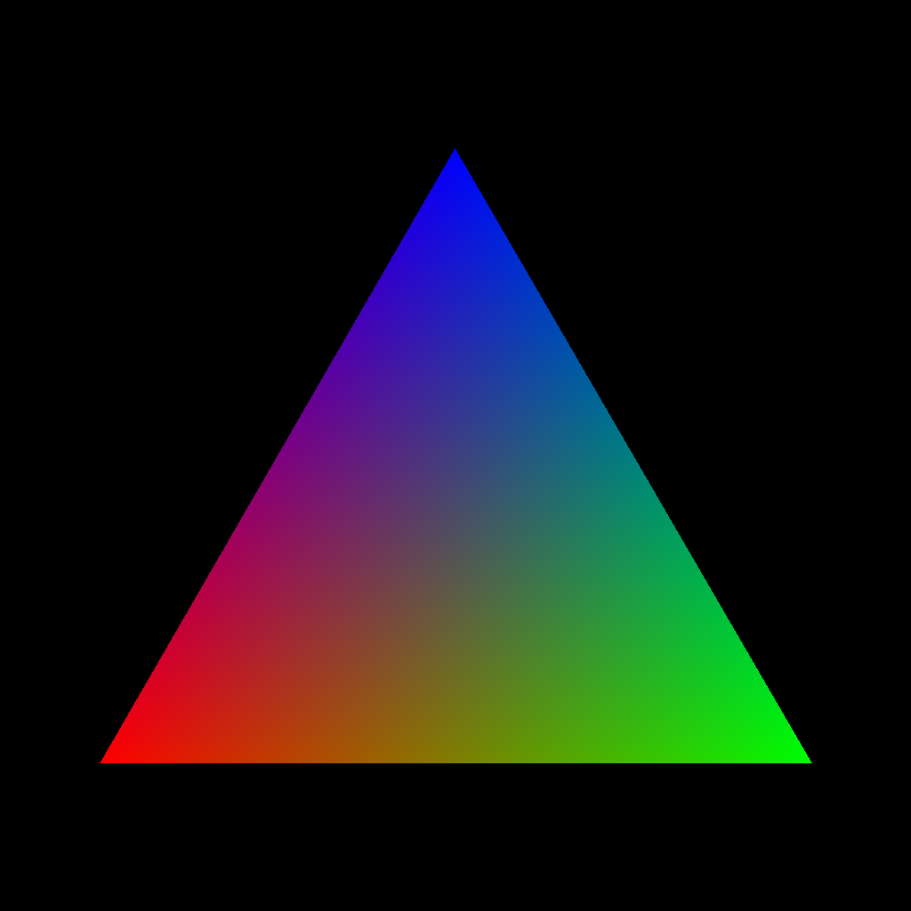

# etude-triangle-cpu

This is a homework for CS473, 2020-2021 Spring, of Shanghai Jiao Tong University, which asks for a colorful triangle like the picture below:



The main code is in `etude-triangle-cpu/main.c` , which is commented, except `[^1]`. See the appendix below for details.

## Testing Environment:

- Microsoft Windows 10, 19042.928
- Intel(R) Xeon(R) CPU E3-1505M v5 @ 2.80GHz
- 16GBs of RAM, running at 2133 MHz
- `gcc.exe (x86_64-posix-seh-rev0, Built by MinGW-W64 project) 8.1.0`
- `gcc etude-triangle-cpu/main.c -o main`

## Testing Result:

```
duration: 27.1345000ms
```

## Appendix: logic of the function `solve(pixel_t, pixel_t)`

TL; DR: Regard the triangle as an affine set, which starts at the bottom left, to the other two vertices, and for all points in the triangle, `R + G + B = 255` .

> INFO: a viewer which supports TeX syntax is needed for the text below. 

First, by observation, all points in the triangle satisfy $R + G + B \approx 255$ . If the color space of 8-bit RGB is scaled from $[0, 255]$ to $[0, 1]$ , then it is obvious that it is an affine set, which means all points in the set can be represented in the form of $v = v_0 + \lambda_1 v_1 + \lambda_2 v_2$ , where $\lambda_1, \lambda_2 \in [0, 1]$ , $v_0$ is the vector of the bottom left, and $v_1$ is the vector starting from the bottom left to the bottom right, $v_2$ is the vector starting from the bottom left to the top.

Then, an algorithm naturally appears for determining whether a given point is in the triangle or not, and what color is it corresponding to the point if so:

1. Set the $v_0$ , now assuming it as $(112.0, 166.0)$ ,

2. Set the $v_1$ and $v_2$ , now assuming them as $(800.0, 0.0)$ and $(399.0, 691.0)$ ,

3. For the given $v$ , substract it with $v_0$ and obtain $v' = v - v_0 = (x', y')$ ,

4. Solve the linear system of $v' = \lambda_1 v_1 + \lambda_2 v_2$ , which can be rearranged in the form of matrix:
   
   $$
   \begin{pmatrix}v_1 v_2\end{pmatrix} \begin{pmatrix}\lambda_1 \\ \lambda_2\end{pmatrix} = \begin{pmatrix}800.0 & 399.0 \\ 0.0 & 691.0\end{pmatrix} \begin{pmatrix}\lambda_1 \\ \lambda_2\end{pmatrix} = \begin{pmatrix}x' \\ y'\end{pmatrix}
   $$
   
   which can be solved in the form below:
   
   $$
   \begin{pmatrix}\lambda_1 \\ \lambda_2\end{pmatrix} = \frac{1}{800.0 \cdot 691.0 - 0.0 \cdot 399.0} \begin{pmatrix}691.0 & -399.0 \\ 0.0 & 800.0\end{pmatrix} \begin{pmatrix}x' \\ y'\end{pmatrix}
   $$
   
   which is exactly what `solve(pixel_t, pixel_t)` does.

5. If both $\lambda_1$ , $\lambda_2 \in [0, 1]$ , the point is in the triangle, and vice versa.